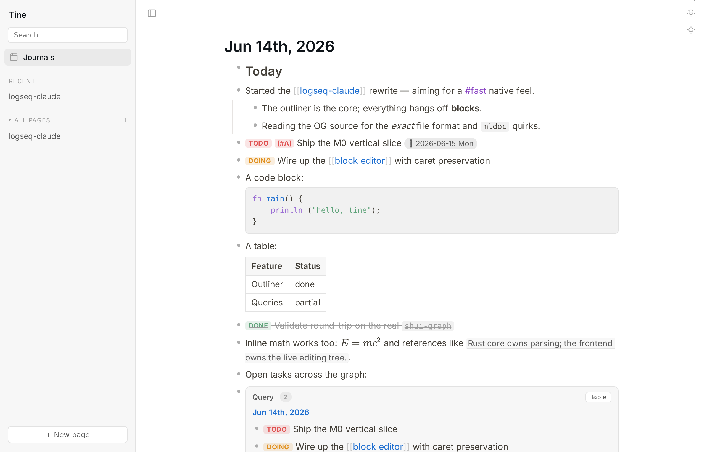
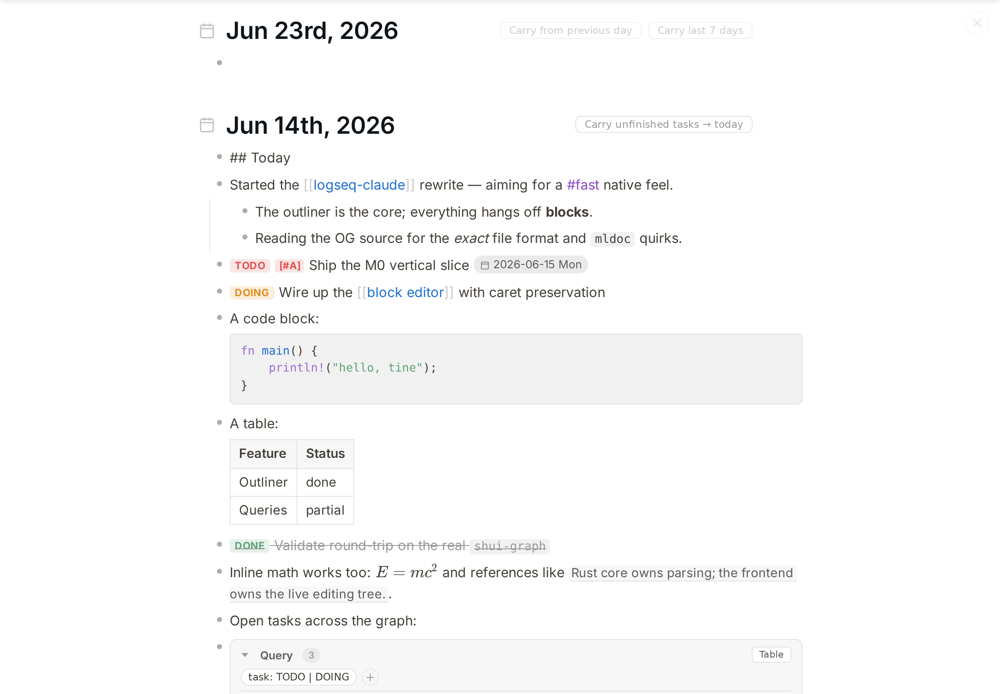
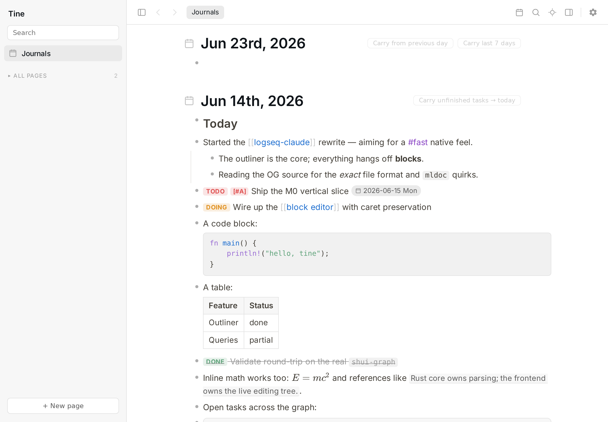
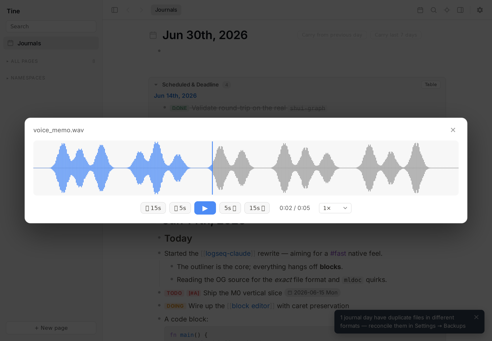

<p align="center">
  
</p>

<p align="center">
  <b>A fast, local, Logseq-compatible outliner.</b><br>
  Reads and writes the <i>same</i> markdown graph as Logseq — swap between the two on the same files.
</p>

<p align="center">
  
  
  
  
  
</p>

<p align="center">
  
</p>

<p align="center">
  <b>▶ <a href="https://tine.page/demo/">Browse a demo graph</a></b> — the onboarding graph, published with Tine's own HTML export.
</p>

---

## What is Tine?

Tine is a desktop outliner built to look and feel like [Logseq](https://logseq.com) while being
much faster. It operates directly on the standard Logseq graph layout —
`journals/`, `pages/`, `assets/`, and `logseq/config.edn` — so you can point it at the graph you
already use and keep editing in either app (one at a time). Files are written back in
Logseq-compatible markdown, so there's **no import/export step and no lock-in**.

**Why build it?** Logseq's UI is Electron + DataScript with heavy re-rendering, and it gets
sluggish on large graphs. Tine is a ground-up rewrite: a small native shell (Tauri/WebKitGTK), a
pure-Rust core for parsing and indexing, and a fine-grained reactive frontend (SolidJS) that never
diffs a virtual DOM. The editor keeps the live block tree in the frontend, so keystrokes never
round-trip to Rust, and whole-graph reads (search, backlinks, queries) hit an in-memory cache
instead of re-parsing.

> **Status:** a usable daily-driver for outlining, linking, tasks, journals, search, queries, and
> PDF annotation. Linux is the primary, best-tested platform; macOS and Windows builds are produced
> too but are newer. Not yet 1.0 — see [Roadmap](#roadmap--non-goals).

---

## Install

Grab a prebuilt installer from the **[Releases](https://github.com/martinkoutecky/tine/releases)**
page. The builds aren't code-signed yet, so your OS may warn the first time — here's how to get past
it:

- **Linux** — the **AppImage** runs on any distro with no install: `chmod +x Tine_*.AppImage`, then
  run it. Or use the **`.deb`** (Debian/Ubuntu) or **`.rpm`** (Fedora/openSUSE).
- **macOS** — open the **`.dmg`**; on first launch macOS says *"unidentified developer"*, so
  **right-click the app → Open** (just once) and it opens normally after that. If Tine then
  **keeps asking to access your Documents folder on every launch**, see the
  [workaround](#macos-repeated-documents-permission-prompt) below.
- **Windows** — run the **`.exe`** installer; if SmartScreen appears, click **More info → Run
  anyway**. Prefer no installer? Grab the portable **`Tine_*_x64-portable.zip`**, unzip, and run
  `Tine.exe` — it needs the WebView2 runtime, which is preinstalled on Windows 10/11.

(Want to hack on Tine instead? Build from source — see [Build & run](#build--run).)

### macOS: repeated "Documents" permission prompt

If your Logseq graph lives in `~/Documents` (the common default), macOS gates access to that
folder behind a permission prompt. Because the build isn't notarized yet **and** is run with the
download "quarantine" flag, macOS launches it from a randomized temporary location each time
([Gatekeeper App Translocation](https://developer.apple.com/library/archive/technotes/tn2206/_index.html)),
so it can't remember your answer — and re-asks on every launch. To make the grant stick:

1. **Move `Tine.app` into `/Applications`** (drag it out of the disk image / Downloads).
2. Clear the quarantine flag in Terminal:
   ```sh
   xattr -dr com.apple.quarantine /Applications/Tine.app
   ```
3. Launch Tine from `/Applications` and **Allow** the Documents prompt once — it won't ask again.

(Both this and the "unidentified developer" warning disappear once Tine ships notarized macOS
builds.)

---

## What Tine adds on top of Logseq

These are the things that started as *"I wish Logseq did this"* — Tine's reasons to exist beyond
raw speed. (Comparisons are against current Logseq desktop core, no plugins.)

- **⚡ Native speed.** Pure-Rust core + SolidJS fine-grained reactivity + a tiny Tauri/WebKitGTK
  runtime instead of Electron — typing stays in the frontend tree, reads hit an in-memory index.
- **🗂️ Built-in tabs.** Middle-click anything to open it in a background tab; pin, drag-reorder,
  `Mod+W` to close. (Logseq core has none.)
- **⏯️ Browser-style back/forward** — `Alt+Left` / `Alt+Right`, per-tab history, works mid-edit.
- **🎯 Focus mode + dim-inactive-blocks** (`t f` / `t b`) — fade everything but the block you're on.
- **⚡ Global quick-capture** — bind `tine --capture` to a desktop hotkey and a small always-on-top
  box pops from *any* app with the full editor, filing a bullet to today's journal.
- **🔁 Carry unfinished tasks forward** to today (last 7 / 30 / 365 days, or a configurable N).
- **🛟 A real data-safety story** — conflict detection instead of silent overwrites, launch
  snapshots with one-click restore, and delete-to-trash; built to live safely on a graph you also
  edit from Logseq mobile over Syncthing.
- **👋 First-run onboarding** — a Welcome screen that opens an existing graph or creates a new one
  pre-loaded with a short, narrated demo graph (which opens in Logseq too).

<p align="center">
  
  
  
</p>

<p align="center">
  <br>
  <sub>Paste audio, then <b>⤢ Expand</b> to a waveform scrubber (±5s / ±15s skip, speed, time read-out) — no Logseq-core equivalent.</sub>
</p>

---

## Features

A quick map of what's in the box — the **[full feature list lives in docs/FEATURES.md](docs/FEATURES.md)**,
and the **[demo](https://tine.page/demo/)** shows the rendered-content side of it in your browser.

| Area | Highlights |
|------|-----------|
| **Outliner** | Click-to-edit with exact caret landing, Logseq keyboard semantics, zoom, drag-reorder, multi-block select; in-block lists & checklists; callouts; a live `/calc` block. |
| **Media** | Paste/import images, video & audio; configurable asset names; drag-resize images *and* video; an audio waveform overlay player; image lightbox; orphaned-media cleanup. |
| **Links, refs & queries** | `[[page]]` · `#tag` · `((block ref))` · `{{embed}}` with autocomplete; live linked/unlinked references; per-block ref counts; the macro set; a `{{query}}` engine with a visual builder; a scoped Datalog path. |
| **Tasks, journals & dates** | Task workflows + priorities, scheduled/deadline with a date picker, recurring tasks, carry-forward, a multi-day journal feed, agenda, and a calendar. |
| **PDF** | Zoomable virtualized viewer, in-PDF find, text + area (image) highlights stored Logseq-compatibly, each a bullet you can annotate. |
| **Search & nav** | `Ctrl+K` switcher (titles + full text), command palette, namespace tree, tabs, back/forward, focus mode, global quick-capture, page icons. |
| **Your files** | Safe to run alongside Logseq mobile over Syncthing — conflict detection, format-preserving atomic saves, transactional rename, org-mode (byte-faithful or read-only), snapshots + trash. |
| **Customize & export** | Remappable shortcuts with `?` help, themes + custom CSS, multi-language spell check, static HTML export with offline search, copy/export as Markdown. |

→ **[See every feature, with the details, in docs/FEATURES.md.](docs/FEATURES.md)**

---

## Built with

| Layer | Tech | Notes |
|------|------|-------|
| Shell | [Tauri 2](https://tauri.app) (Rust) | OS webview (WebKitGTK on Linux) — tiny runtime vs Electron |
| Frontend | [SolidJS](https://solidjs.com) + TypeScript + [Vite](https://vitejs.dev) | fine-grained reactivity, no virtual-DOM churn |
| Core | `crates/tine-core` (pure Rust) | parse/serialize, model, indexing, queries, refs, dates, PDF/EDN, HTML publish |
| Rendering | [pdf.js](https://mozilla.github.io/pdf.js/), [KaTeX](https://katex.org), highlight.js | PDF, math, code |

The Rust core is GUI-free and unit-tested in isolation; the Tauri layer is a thin set of ~41 IPC
commands over it. The frontend owns the live editing tree (normalized store) and pushes debounced,
format-preserving saves; whole-graph reads hit an in-memory page cache (`RwLock<Arc<Graph>>` — read
commands clone the Arc and release the lock immediately) keyed by a graph generation counter.

The bigger architectural choices — Tauri/WebKitGTK over Electron, the pure-Rust core, in-browser
WASM parsing, the data-safety invariants — are written up as short decision records in
[`docs/adr/`](docs/adr/).

## Project layout

```
crates/tine-core/    Rust core: parse/serialize, model, config, dates, refs, query, pdf, edn, publish
src-tauri/           Tauri app — IPC commands + windows (main + quick-capture)
src/                 SolidJS frontend (components, store, render pipeline, keybindings)
scripts/             env.sh (toolchain paths), screenshot generators
docs/                Logo, images, FEATURES.md, ADRs, feature notes
samples/             Demo graph used by tests/screenshots
```

## Build & run

```bash
source scripts/env.sh        # toolchain env (CARGO_HOME/RUSTUP_HOME, lib paths)
npm install                  # first time

# Build the release binary (NOT plain `cargo build` — that produces a dev-mode
# binary that can't connect to the bundled frontend):
npx tauri build --no-bundle

# Run it against your graph:
TINE_GRAPH=/path/to/your/graph ./target/release/tine
```

### Release checklist

Before tagging a release, run `npm run e2e:caret` against the release binary to
guard the ADR 0013 duplicate-instance caret/focus invariant.

- Point `TINE_GRAPH` at the same `journals/` + `pages/` + `logseq/config.edn` tree you use with
  Logseq. **Run one app at a time** on a given graph.
- **GPU compositing (smooth scrolling) is on by default.** On the rare GPU/compositor combo where
  WebKitGTK's DMABUF renderer aborts (the window fails to appear, or you see
  `EGL_BAD_PARAMETER` on the console), set `TINE_GPU=0` to fall back to software rendering — slower,
  but it always starts. If Tine detects it's painting on the CPU it now says so with a banner.
- Prefer the **raw binary** over an AppImage on Linux — an AppImage's bundled graphics libraries can
  clash with the host GPU and silently drop you to (slow) software rendering. The `.deb`/`.rpm`
  packages use your system's drivers and don't have this problem.

### Troubleshooting a bad startup (debug mode)

If Tine won't start cleanly (e.g. the window never appears), run it with debug logging on. It writes
a timestamped trace to a file — the environment (renderer, session type, AppImage, graph), every
startup milestone, any panic (with backtrace), and the frontend's own boot/errors — so one file is
usually enough to diagnose it:

```bash
TINE_DEBUG=1 tine                 # or:  tine --debug
TINE_DEBUG=1 ./Tine-*.AppImage    # AppImage
```

Tine prints the log path on startup; it defaults to `/tmp/tine-debug.log` (override with
`TINE_DEBUG_LOG=/path`). Reproduce the problem, then send that file. The log records no note content
— only startup diagnostics.

**Quick capture** — at the top of the journal feed, a page-title field + a body composer: fill the
title to capture a **new page**, leave it empty to **append to today**, then `Ctrl-Shift-Enter`.
**Global quick-capture:** bind your desktop environment's keyboard settings to run
`tine --capture` (a second launch is routed to the running instance via single-instance).

### Develop

```bash
npm run dev                  # frontend only, in a browser, against an in-memory mock backend
npm run app                  # full Tauri dev window  (alias for: tauri dev)
node scripts/screenshot.mjs  # regenerate screenshots from the mock backend
```

## Testing

```bash
source scripts/env.sh
cargo test -p tine-core      # Rust: parse/serialize round-trip, model, queries, search cache
npm test                     # Frontend: Vitest (editor ops, outline, autocomplete, markers, …)
```

Round-trip parsing is validated against a real Logseq graph (0 structural diffs beyond accepted
canonicalization); `tine-check` is a privacy-safe profiler that proves byte-faithful serialization
without reading note content.

## Contributing

Tine is a single-maintainer project with an unusual contribution model: **the most valuable thing
you can send is testing and bug reports**, and code changes come in as **proposals/specs the
maintainer implements** rather than merged patches (docs/typo PRs excepted). The why, and how to
file a good report, are in **[CONTRIBUTING.md](CONTRIBUTING.md)**.

## Roadmap & non-goals

**Planned / under evaluation:** graph view, configurable typographic auto-replace, and **broader
coverage of advanced Datalog queries** (a scoped subset works today — see above).

**Out of scope (by design):** whiteboards, flashcards, the plugin system, and built-in git. Today
Tine coexists with the Logseq mobile app over your own sync; a native Android build (Tauri v2) is
under evaluation.

The full working backlog — what's next, what's deferred, and what's explicitly WONTFIX — lives in
[`docs/BACKLOG.md`](docs/BACKLOG.md).

## Acknowledgements

Tine is an independent reimplementation, not a fork — the codebase is original Rust + SolidJS and
contains no Logseq source. It does target Logseq's on-disk format and adapts parts of Logseq's
outliner CSS (variables and bullet/indent rules), so it is a derivative work for licensing purposes
and is released under the same license.

[Logseq](https://github.com/logseq/logseq) is © its authors, licensed AGPL-3.0. Tine is **not
affiliated with or endorsed by Logseq.** Thanks to the Logseq project for the format and the design
it pioneered.

## License

[GNU AGPL-3.0-only](LICENSE).

Copyright (C) 2026 Martin Koutecký.

This program is free software: you can redistribute it and/or modify it under the terms of the GNU
Affero General Public License as published by the Free Software Foundation, version 3. It is
distributed in the hope that it will be useful, but WITHOUT ANY WARRANTY; without even the implied
warranty of MERCHANTABILITY or FITNESS FOR A PARTICULAR PURPOSE. See the [LICENSE](LICENSE) for
details.

---

<sub>Built ground-up as a faster, file-compatible alternative to Logseq. Not affiliated with Logseq.</sub>
