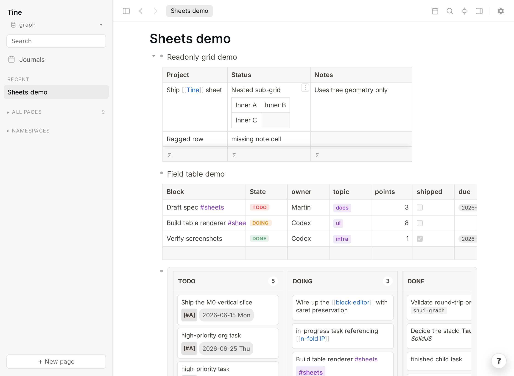

<p align="center">
  
</p>

<p align="center">
  <b>流畅、本地运行、兼容 Logseq 的大纲笔记软件。</b><br>
  可直接使用与 Logseq <i>相同的</i> Markdown 图谱——可以在同一组文件上交替使用两款应用。
</p>

<p align="center">
  <a href="README.md">English</a> | <a href="README.zh-CN.md">简体中文</a><br>
  <sub>本译文基于英文 README 修订版 <code>682cba63acb0ffb62698f0a063949f8e2515a230</code>（2026-07-10）。若中英文内容存在差异，请以最新英文 README 为准。</sub>
</p>

<p align="center">
  
  
  
  
  
</p>

<p align="center">
  
</p>

<p align="center">
  <b>▶ <a href="https://tine.page/demo/">查看演示图谱</a></b> —— 使用 Tine 自身的 HTML 导出功能发布的入门图谱。
</p>

---

## 什么是 Tine？

Tine 是一款大纲笔记软件，外观和操作体验与 [Logseq](https://logseq.com) 相近，但它要流畅很多。它直接使用标准的 Logseq 图谱目录结构——
`journals/`、`pages/`、`assets/` 和 `logseq/config.edn`——因此可以用它打开你的笔记图谱，并在两款应用之间交替编辑（同一时间只运行一个）。文件会以兼容 Logseq 的 Markdown 格式写回，因此在两款软件之间**无需导入或导出，也不会被锁定在某个应用或专有格式中**。

**为什么要开发 Tine？** Logseq 的界面基于 Electron 和 DataScript，在处理大型图谱时，较重的重复渲染容易让操作逐渐变慢。Tine 因此选择从底层重新实现：使用轻量的原生应用外壳 Tauri/WebKitGTK，以纯 Rust 核心负责解析和索引，并采用 SolidJS 构建细粒度响应式前端，无需反复比较和更新虚拟 DOM。编辑器会在前端直接维护实时块树，因此每次按键都不必在前端与 Rust 核心之间来回传递；搜索、反向链接和查询等需要读取整个图谱的操作，则直接使用内存缓存，而不必每次重新解析文件。

> **状态：** Tine 已可作为日常主力工具，用于大纲编辑、链接、任务、日记、搜索、查询和 PDF 标注。Linux 是主要平台，测试也最充分；macOS 和 Windows 构建同样可用，但推出时间较短。尚未达到 1.0——[请看路线图](#roadmap--non-goals)。

---

## 安装

可前往 **[Releases](https://github.com/martinkoutecky/tine/releases)** 页面下载预编译安装包。当前发布版本尚未进行代码签名，因此首次运行时，操作系统可能会弹出安全警告。可按以下方式继续安装或启动：

- **Linux** —— **AppImage** 无需安装，可在任何发行版上运行：先执行 `chmod +x Tine_*.AppImage`，然后启动它。也可使用 **`.deb`**（Debian/Ubuntu）或 **`.rpm`**（Fedora/openSUSE）。
- **macOS** —— 打开 **`.dmg`**；首次启动时 macOS 会提示“*身份不明的开发者*”，请**右键点按应用 → 打开**（仅需一次），之后即可正常打开。若 Tine 随后**每次启动都反复请求访问“文稿”文件夹**，请参阅下方的[解决办法](#macos-repeated-documents-permission-prompt)。
- **Windows** —— 运行 **`.exe`** 安装程序；如果出现 SmartScreen 提示，请点击**更多信息 → 仍要运行**。若不想安装，也可以下载便携版 **`Tine_*_x64-portable.zip`**，解压后直接运行 `Tine.exe`。Tine 需要 WebView2 运行时，而 Windows 10/11 已预装该运行时。

（想参与 Tine 开发？请从源码构建——参见[构建与运行](#build--run)。）

<a id="macos-repeated-documents-permission-prompt"></a>
### macOS：反复请求“文稿”访问权限

如果你的 Logseq 图谱位于 `~/Documents`（常见的默认位置），macOS 会通过权限提示限制应用访问该文件夹。由于当前构建尚未完成公证，并且仍带有下载文件的“隔离”标记，系统每次启动 Tine 时，都会通过 [Gatekeeper App Translocation](https://developer.apple.com/library/archive/technotes/tn2206/_index.html) 将它放到一个随机的临时位置运行。这样一来，macOS 无法记住此前授予的权限，因此每次启动时都会再次询问。要让这项授权长期生效，请按以下步骤操作：

1. 将 `Tine.app` **移至 `/Applications`**（从磁盘映像或“下载”文件夹中拖出）。
2. 在终端中清除隔离标记：
   ```sh
   xattr -dr com.apple.quarantine /Applications/Tine.app
   ```
3. 从 `/Applications` 启动 Tine，并在“文稿”权限提示中点击一次**允许**——之后便不会再询问。

（当 Tine 发布经过公证的 macOS 构建后，上述问题及“未识别的开发者”警告都会消失。）

---

## Tine 在 Logseq 基础上增加了什么

以下功能都源于这样一个想法：“*要是 Logseq 本就支持这些就好了。*”除了性能优势之外，它们也是 Tine 得以存在的重要原因。（比较对象为当前 Logseq 桌面端核心，不含插件。）

- **⚡ 原生速度。** 以纯 Rust 核心、SolidJS 细粒度响应式和小巧的 Tauri/WebKitGTK 运行时取代 Electron——输入处理始终在前端块树中完成，读取则直接命中内存索引。
- **🗂️ 内置标签页。** 中键点击任何内容即可在后台标签页打开；可固定、拖动排序，按 `Mod+W` 关闭。（Logseq 核心没有此功能。）
- **🪟 分屏视图。** 每个窗格都有独立的标签页和历史记录，支持用键盘在窗格与分隔线之间导航、按 `Ctrl+click` 在侧边打开内容，以及将标签页拖到窗格或分隔线上。
- **⏯️ 浏览器式后退/前进** —— `Alt+Left` / `Alt+Right`，每个标签页各有历史记录，编辑中也可使用。
- **🎯 专注模式 + 弱化非编辑块**（`t f` / `t b`）——视觉弱化编辑以外的所有内容。
- **⚡ 全局快速笔记** —— 将 `tine --capture` 绑定到桌面快捷键后，即可从*任意*应用唤出一个置顶小窗口。窗口内提供完整编辑器，可将一个块写入今日日记。
- **🔁 将未完成的任务顺延**到今天（可回溯过去 7 / 30 / 365 天，也可自定义为 N 天）。
- **▦ Sheets（结构化视图）** —— 在普通项目符号块之上提供递归网格、Markdown 数据库、类型化字段表、公式列与可视化筛选构建器、任务/标签看板、聚合、颜色以及 CSV 导入。
- **📖 应用内指南** —— Help → Guide（帮助 → 指南）会在你自己的图谱旁打开内置的只读操作指南；Copy the guide into your graph（将指南复制到图谱）则会创建一个可编辑、相互链接的 `tine-guide/…` 沙盒，同时不改动原始内容。
- **🛟 一套真正的数据安全机制** —— 使用冲突检测而不是静默覆盖，提供可一键恢复的启动快照，并将删除的内容移入回收站；即使图谱通过 Syncthing 与 Logseq 移动端同步，也能安全使用。
- **👋 首次运行引导** —— 欢迎界面可打开现有图谱或创建新图谱，并预装简短、带讲解的演示图谱（同样可在 Logseq 中打开）。

<p align="center">
  
  
  
</p>

<p align="center">
  
</p>

<p align="center">
  <br>
  <sub>粘贴音频后，点击 <b>⤢ Expand（展开）</b> 即可使用音波进度条（±5 秒 / ±15 秒跳转、播放速度、时间显示）——Logseq 没有对应的核心功能。</sub>
</p>

---

## 功能

下面是现有功能的快速概览——完整功能列表见 **[docs/FEATURES.md](docs/FEATURES.md)**；也可在浏览器中通过**[演示](https://tine.page/demo/)**查看内容的实际渲染效果。

| 领域 | 主要功能 |
|------|-----------|
| **大纲** | 点击即可编辑，并将光标准确定位到点击位置；与 Logseq 一致的键盘操作语义；缩放、拖动排序和多块选择；块内列表与检查清单；提示块；实时 `/calc` 块。 |
| **媒体** | 粘贴/导入图像、视频与音频；可配置资源文件名；拖动调整图像*和*视频尺寸；音频波形悬浮播放器；图像灯箱；清理孤立媒体。 |
| **链接、引用与查询** | 支持自动补全的 `[[page]]` · `#tag` · `((block ref))` · `{{embed}}`；实时显示已链接与未链接的引用；每个块的引用计数；宏集合；带可视化构建器的 `{{query}}` 引擎；限定范围的 Datalog 查询路径。 |
| **任务、日记与日期** | 任务工作流与优先级、通过日期选择器设置计划日期/截止日期、循环任务、任务顺延、多日日记流、议程和日历。 |
| **PDF** | 可缩放的虚拟化查看器、PDF 内搜索、以兼容 Logseq 的方式保存文本高亮和区域（图像）高亮；每处高亮都会生成一个可继续添加注释的块。 |
| **搜索与导航** | `Ctrl+K` 切换器（标题与全文搜索）、命令面板、应用内指南、命名空间树、标签页、分屏、后退/前进、专注模式、全局快速笔记、页面图标。 |
| **你的文件** | 可安全地与通过 Syncthing 同步的 Logseq 移动端配合使用——冲突检测、保留格式的原子保存、事务式重命名、Org mode（逐字节保真或只读）、快照与回收站。 |
| **自定义与导出** | 可重新映射快捷键，支持 `?` 帮助；内置主题库与自定义 CSS；多语言拼写检查；含离线搜索的静态 HTML 导出；复制/导出为 Markdown；**将页面导出为 PDF**。 |

→ **[在 docs/FEATURES.md 中查看所有功能及详细说明。](docs/FEATURES.md)**
→ **[Tine 与 Logseq 的逐项功能对比](https://tine.page/compare.html)** —— 一份坦诚且标注日期的比较：哪些功能已经对应、哪些仅在有限范围内支持、哪些尚未实现，以及 Tine 有意不做什么。

---

## 技术栈

| 层级 | 技术 | 说明 |
|------|------|-------|
| 应用外壳 | [Tauri 2](https://tauri.app) (Rust) | 使用操作系统 WebView（Linux 上为 WebKitGTK）——运行时比 Electron 小得多 |
| 前端 | [SolidJS](https://solidjs.com) + TypeScript + [Vite](https://vitejs.dev) | 细粒度响应式，不会反复更新虚拟 DOM |
| 核心 | `crates/tine-core`（纯 Rust） | 解析/序列化、模型、索引、查询、引用、日期、PDF/EDN、HTML 发布 |
| 渲染 | [pdf.js](https://mozilla.github.io/pdf.js/)、[KaTeX](https://katex.org)、highlight.js | PDF、数学公式、代码 |

Rust 核心不依赖 GUI，可单独进行单元测试；Tauri 层只是在其上提供约 41 个 IPC 命令的轻量封装。前端维护实时编辑树（规范化状态库），以防抖方式触发保留格式的保存；全图谱读取则命中按图谱版本计数器区分的内存页面缓存（`RwLock<Arc<Graph>>`——读取命令会克隆 Arc 并立即释放锁）。

更重要的架构选择——以 Tauri/WebKitGTK 取代 Electron、采用纯 Rust 核心、在浏览器内进行 WASM 解析，以及数据安全不变量——均已写成简短的架构决策记录，位于 [`docs/adr/`](docs/adr/)。

## 项目布局

```
crates/tine-core/    Rust 核心：解析/序列化、模型、配置、日期、引用、查询、PDF、EDN、发布
src-tauri/           Tauri 应用：IPC 命令和窗口（主窗口 + 全局快速笔记）
src/                 SolidJS 前端（组件、状态库、渲染管线、按键绑定）
scripts/             env.sh（工具链路径）、截图生成器
docs/                Logo、图片、FEATURES.md、ADR、功能说明
samples/             测试和截图使用的演示图谱
```

<a id="build--run"></a>
## 构建与运行

```bash
source scripts/env.sh        # 工具链环境（CARGO_HOME/RUSTUP_HOME、库路径）
npm install                  # 首次运行时执行

# 构建发布版二进制文件（不要直接使用 `cargo build`，那会生成开发模式的
# 二进制文件，无法连接到随附的前端）：
npx tauri build --no-bundle

# 对你的图谱运行：
TINE_GRAPH=/path/to/your/graph ./target/release/tine
```

### 发布检查清单

在创建发布标签前，请对发布版二进制文件运行 `npm run e2e:caret`，防止 ADR 0013 所规定的重复实例光标/焦点行为出现回归。

- 将 `TINE_GRAPH` 指向你与 Logseq 共用的同一个 `journals/` + `pages/` + `logseq/config.edn` 目录树。对于同一图谱，**一次只运行一个应用**。
- **GPU 合成（平滑滚动）默认开启。** 在极少数 GPU/合成器组合上，WebKitGTK 的 DMABUF 渲染器可能会中止（窗口无法显示，或控制台出现 `EGL_BAD_PARAMETER`）；请设置 `TINE_GPU=0` 回退到软件渲染——速度会较慢，但始终可以启动。如果 Tine 检测到绘制发生在 CPU 上，会显示横幅提示。
- 在 Linux 上优先使用**原始二进制文件**而非 AppImage——AppImage 内置的图形库可能与主机 GPU 冲突，并悄然降级到（缓慢的）软件渲染。`.deb`/`.rpm` 包使用系统驱动，不会有这个问题。

### 排查启动异常（调试模式）

如果 Tine 无法正常启动（例如窗口始终不出现），请以调试日志模式运行。它会写入一份带时间戳的跟踪日志，其中包含环境信息（渲染器、会话类型、AppImage、图谱）、启动过程中的每个关键阶段、任何 panic（带回溯），以及前端自身的启动信息和错误；通常仅凭这一个文件就足以诊断问题：

```bash
TINE_DEBUG=1 tine                 # 或者：tine --debug
TINE_DEBUG=1 ./Tine-*.AppImage    # AppImage
```

Tine 会在启动时打印日志路径；默认是 `/tmp/tine-debug.log`（可用 `TINE_DEBUG_LOG=/path` 覆盖）。复现问题后，请发送该文件。日志不会记录笔记内容——只记录启动诊断信息。

**快速笔记** —— 日记流顶部提供页面标题字段和正文编辑框：填写标题会创建一个**新页面**，留空则会**追加到今日日记**；完成后按 `Ctrl-Shift-Enter`。**全局快速笔记：**在桌面环境的键盘设置中，将快捷键绑定为运行 `tine --capture`（第二次启动会通过单实例机制转交给已运行的实例）。

### 开发

```bash
npm run dev                  # 仅运行前端；在浏览器中连接内存模拟后端
npm run app                  # 完整的 Tauri 开发窗口（tauri dev 的别名）
node scripts/screenshot.mjs  # 使用模拟后端重新生成截图
```

## 测试

```bash
source scripts/env.sh
cargo test -p tine-core      # Rust：解析/序列化往返、模型、查询、搜索缓存
npm test                     # 前端：Vitest（编辑操作、大纲、自动补全、标记等）
```

往返解析使用真实的 Logseq 图谱进行验证（除已接受的规范化外，结构差异为零）；`tine-check` 是一款保护隐私的性能分析工具，可在不读取笔记内容的前提下验证序列化是否字节级保真。

## 社区

欢迎在 Reddit 社区 **[r/TineOutline](https://www.reddit.com/r/TineOutline/)** 分享问题、想法、截图和错误报告——这里是关注发布动态、参与规划后续方向的最佳地点。对于具体错误或功能请求，也可以[提交 issue](https://github.com/martinkoutecky/tine/issues)。

## 贡献

Tine 是由一位维护者独立维护的项目，采用一种不同寻常的贡献模式：**最有价值的贡献是测试和错误报告**；代码改动应以**提案/规格说明**的形式提出，再由维护者自行实现，而不是直接合并外部补丁（文档和拼写修正 PR 除外）。这样做的原因以及如何提交高质量报告，请参阅 **[CONTRIBUTING.md](CONTRIBUTING.md)**。

<a id="roadmap--non-goals"></a>
## 路线图与非目标

**新增——Sheets（二维网格与数据库）：**将块的子块渲染为可递归、可编辑的 TreeSheets 风格网格、字段表或看板，同时所有内容仍保持为纯 Logseq Markdown/Org（参见 [FEATURES.md](docs/FEATURES.md#sheets-2-d-grids)）。功能包括类型化数据模式、查询驱动的表格、任务/标签看板、分组、聚合、Markdown 表格转换、带可视化公式构建器的计算列、筛选器以及 CSV/TSV 导入。

**新增——分屏视图：**每个窗格都有独立的标签页和历史记录，支持 TreeSheets 风格的窗格与分隔线导航、按 `Ctrl+click` 在侧边打开，以及将标签页拖到窗格或分隔线上（参见 [FEATURES.md](docs/FEATURES.md#split-view)）。

**计划中 / 评估中：**图谱视图和可配置的排版字符自动替换。

**移动端：**自 0.4.0 起，Tine 已提供**原生 Android 构建**（Tauri v2）——可通过你自行选择的同步方式，在手机上打开和编辑真实的 Logseq 图谱，并与 Logseq 移动端配合使用。iOS 版本正在规划中。

**明确不做（设计如此）：**白板、记忆卡片（Flashcards）、插件系统和内置 Git。

完整的开发待办——接下来要做什么、延后什么，以及明确标记为 WONTFIX 的内容——位于 [`docs/BACKLOG.md`](docs/BACKLOG.md)。

## 支持

Tine 免费且开源，是我利用忙碌生活中的零碎时间开发的项目。如果它让你记笔记更快、日常使用更顺手，而你愿意请我喝杯咖啡表达谢意——我会非常开心，也由衷感激。所有捐赠都会优先用于 Tine 的运营成本，例如域名，以及未来可能需要的应用商店注册费用。

有件事需要坦诚说明，以免彼此误解：**捐赠不会改变我对 Tine 工作的优先级，也不能换取某项功能。** 我会在有时间时开发 Tine，并选择自己认为值得做的事情——赞助不会改变这一点。请把它视为对现有成果的感谢，而不是对未来工作的预付款。无论是否赞助，彼此都没有任何期待或义务。🌱

[](https://ko-fi.com/martinkoutecky)
· [GitHub Sponsors](https://github.com/sponsors/martinkoutecky)

## 致谢

Tine 是一个独立重新实现的项目，并非 fork——整个代码库使用 Rust + SolidJS 原创编写，不包含任何 Logseq 源代码。不过，它以 Logseq 的磁盘格式为兼容目标，并改编了 Logseq 大纲 CSS 的一部分（变量以及项目符号/缩进规则），因此从许可角度看属于衍生作品，并采用相同的许可证发布。

[Logseq](https://github.com/logseq/logseq) 版权归其作者所有，采用 AGPL-3.0 许可证。Tine **与 Logseq 没有关联，也未获得 Logseq 官方认可或背书。** 感谢 Logseq 项目提供了这种格式，以及它所开创的设计。

## 许可证

[GNU AGPL-3.0-only](LICENSE)。

版权所有 (C) 2026 Martin Koutecký。

本程序是自由软件：你可以根据自由软件基金会发布的 GNU Affero General Public License 第 3 版条款重新发布和/或修改本程序。本程序的发布是希望它能够发挥作用，但**不提供任何担保**；甚至不包含对**适销性**或**特定用途适用性**的默示担保。详情请参阅 [LICENSE](LICENSE)。

---

<sub>从零构建，作为速度更快、兼容 Logseq 文件格式的替代方案。与 Logseq 没有关联。</sub>
