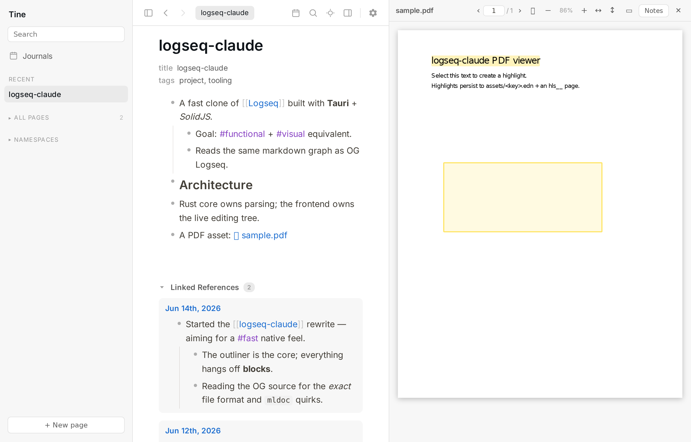
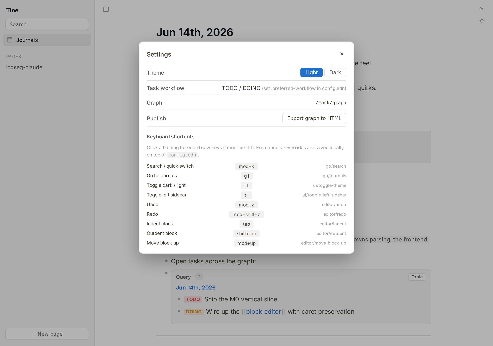
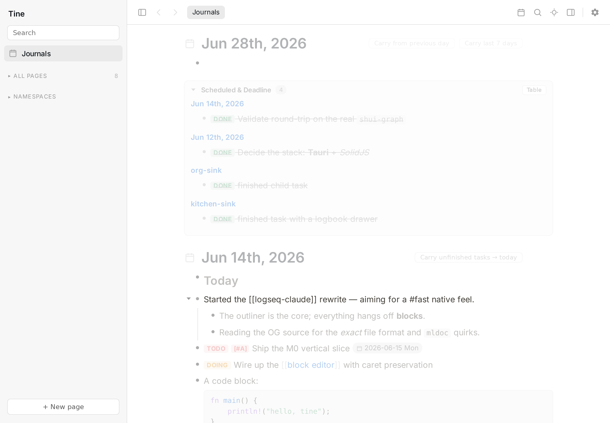
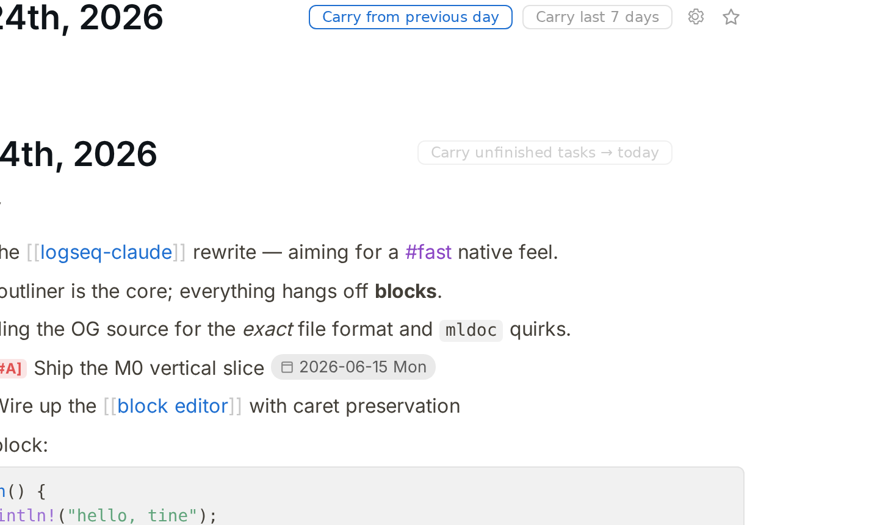
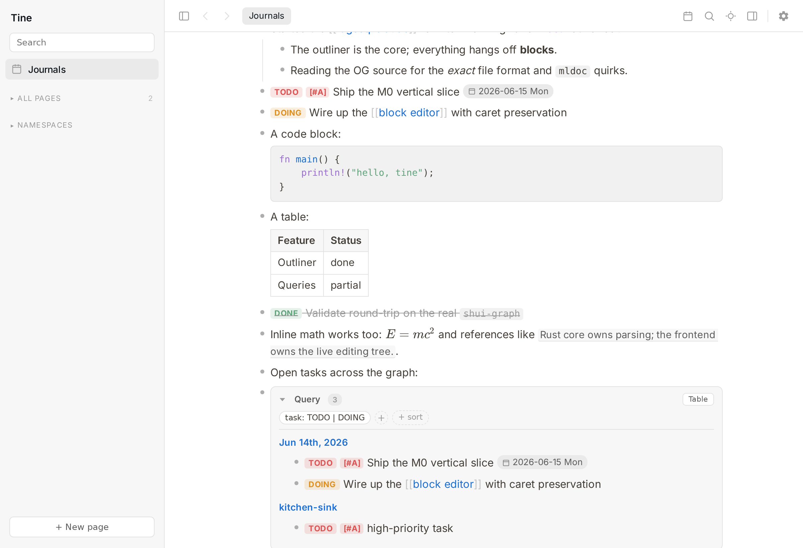

# Tine — full feature list

The complete catalogue. For the short pitch and install instructions, see the
[README](../README.md).

Tine **matches Logseq ("OG") by default** and round-trips the same Markdown/`.org`
files. **⊕ marks things Tine adds on top of Logseq core** (no plugins).

## Outliner & editing

- Click-to-edit blocks; the caret lands exactly where you clicked, including
  rendered bold/link/heading markup.
- `Enter` / `Tab` / `Shift+Tab` / `Backspace` / arrows with correct Logseq
  semantics and caret preservation — no reflow on indent/outdent; arrow nav
  respects *visual* wrapped rows.
- Collapse/expand, zoom into a block (with breadcrumb), drag-to-reorder, move
  up/down (`Alt+Shift+↑/↓`).
- Multi-block selection → move / indent / cut / copy; the viewport follows the
  active end as you extend past the top/bottom edge.
- Multi-line blocks, syntax-highlighted code blocks, Markdown tables.
- Paste an indented outline → a real block tree; paste a clipboard image → a graph
  asset.
- Inline formatting (`Mod+B/I`, strike, `==highlight==`, link) via a floating
  selection toolbar, plus Emacs-style word/line kill motions.
- ⊕ **Optional auto-pairing** (Settings → Appearance) — typing `(` `[` `{` `"`
  `` ` `` inserts the matching closer with the caret between, wraps a selection,
  types through a closer, and `Backspace` on an empty pair clears both. **Off by
  default** (turn it on if you like it); page-ref `[[…]]` always auto-closes.
- ⊕ **Typographic replacements** (Settings → Appearance) — show `->` → `→`,
  `-->` → `⟶`, `--` → `–` (en), `---` → `—` (em) and friends as real glyphs,
  either *while reading* (your Markdown stays ASCII, only the rendered view
  changes — like `\Delta` → Δ) or *while typing* (rewrites the source itself). A
  Tine touch, not Logseq; default *while reading*, or turn it off.
- **In-block lists & checklists** — a `+`/`*`/ordered list *inside one bullet's
  content* renders as a styled list (distinct from outline bullets), with tickable
  `[ ]`/`[x]` checkboxes that are *not* TODO/agenda tasks. Uses `+` (OG's in-content
  marker) so it round-trips to OG and Logseq mobile.
- **Callouts / admonitions** — both Obsidian-style `> [!note] …` and org
  `#+BEGIN_NOTE … #+END_NOTE` render as colored callouts (`QUOTE` stays a plain
  blockquote).
- ⊕ **`/calc` block** — evaluates arithmetic live as you type (`+ - * / ^ %`,
  parentheses, `name = expr` variables across lines, a running result).

## Media

- Paste/import **images, video, and audio** (`/upload`); stored as
  ``.
- **Configurable asset filenames** (Settings → Backups → *Asset names*): a
  `%`-token template — `%assetname %ext %yyyymmdd %hhmmss` (and granular `%yyyy %MM
  %dd %HH %mm %ss`) — defaulting to the plain original name, with a one-click
  *Date + name* preset.
- **Drag the corner grip to resize an image *or a video*** — stored as a width % in
  Logseq's `{:width …}` brace, so it round-trips.
- ⊕ **Audio ⤢ Expand** opens a wide overlay player — a **waveform scrubber** with
  ±5s / ±15s skip, play/pause, speed, and a time read-out.
- Click an image for a **lightbox** (Esc / click-away to close; right-click / Copy
  puts it on the clipboard).
- Video/audio play **inline** where the codec is supported, else fall back to a
  click-to-open chip that launches the OS default player (Tine scrubs its own render
  env and detaches the child so the player doesn't inherit a broken video context).
- **Orphaned-media cleanup** (Settings → Backups): scan for `assets/` files no block
  references and move them to the recoverable trash — deleting a block never deletes
  its media, so this is how unused files get reclaimed.

## Linking, references & queries

- `[[page]]`, `#tags`, `#[[multi word]]`, `((block ref))` — including the labeled
  form `[text](((id)))` — and `{{embed}}`, all clickable, with autocomplete on
  `[[`, `#`, `((`, and `/`.
- The `((` popup full-text-searches blocks and inserts a **durable** reference
  (writes a stable `id::` first).
- The `[[`/`#` Enter default is configurable (Settings → *Journals & tasks* →
  **Link autocomplete default**): create-a-new-page (default, like Logseq) or
  link-the-first-match.
- **Linked & unlinked references** on every page (live/editable), with co-reference
  filtering and hover previews — and in the **right sidebar** page view too
  (shift-click a page to open it there).
- **Per-block reference count** badge → click to reveal the referencing blocks
  (grouped by page, each with its **ancestor breadcrumb**), or shift-click to open
  in the sidebar.
- **Right-click an inline `((ref))`** for a menu (open in sidebar / go to block /
  copy ref / copy embed); in the editor, **`Mod+C` with nothing selected copies a
  reference** to the current block.
- Inline block refs render as **link-styled text** (full-strength color + accent
  underline, like OG — not a grey chip).
- Copying a block **strips `id::`** from the clipboard text (like OG) so it never
  leaks into a paste — though the `id::` stays in the file so sidebar/tab/zoom spots
  persist a restart. Copy behavior is configurable (Settings → Journals & tasks),
  with two Tine defaults that differ from Logseq (one click to revert): *copy only
  the selected blocks* (vs Logseq's whole sub-tree) and *strip `collapsed::`*.
- **Macros:** `{{query}}`, `{{embed}}`,
  `{{video}}`/`{{youtube}}`/`{{vimeo}}`/`{{bilibili}}`, `{{tweet}}`/`{{twitter}}`,
  `{{img url [w h] [left|right|center]}}`, `{{namespace}}`, and **user-defined
  `:macros`** from `config.edn` (`$1..$N` substitution, rendered as Markdown).
  `{{youtube-timestamp}}`, `{{cloze}}` (click-to-reveal) and `{{zotero-*}}` render in
  a degraded form (no on-page-player seek / SRS / Zotero connector — flagged inline).
- **`{{query}}` engine** (inline or whole-block): boolean `and`/`or`/`not`,
  `(task …)`, `(priority …)`, `(property …)`, `(page-property …)`, `(page-tags …)`,
  `(scheduled)`, `(deadline)`, `(journal)`, `(namespace …)`, `(between START END)`
  with a field selector, `(sort-by …)`. Results render as a list or a sortable
  **table**; ⊕ an interactive **visual query builder** (chip/clause bar) builds them
  without writing the DSL.
- A scoped compatibility path for Logseq's **advanced (Datalog) queries**:
  recognized clauses (`task`, `between`, `property`, `page-property`, `priority`,
  page-refs, boolean `or/and/not`, `:today`/`:current-page`-style inputs) map onto
  the same engine; any unsupported part is **flagged** in the result rather than
  silently dropped or wrongly answered.

## Tasks, journals & dates

- `TODO/DOING/DONE/NOW/LATER/WAITING/CANCELED`, two configurable workflows,
  priorities, cycle with `Mod+Enter`.
- `SCHEDULED:` / `DEADLINE:` via a calendar **date picker** (`/scheduled`,
  `/deadline`), including **recurring tasks** (`+1w` / `.+1w` / `++1w`) where
  completing a repeater advances the date. You can type a planning line *anywhere*
  in a block while editing; on exit it's moved to its canonical position (after the
  first line, before properties — OG's layout). A `SCHEDULED:`/`DEADLINE:` inside
  inline code or a code fence stays literal content (it's not a real timestamp), so
  it's never turned into a date badge or moved.
- ⊕ **Carry unfinished tasks forward** to today (presets for the last 7 / 30 / 365
  days or a configurable N), optionally keeping ancestor context.
- Multi-day **journal feed** (one continuous editable list); today's journal created
  lazily on first edit; move blocks across days.
- An **agenda** of *open* scheduled/deadline items (DONE and CANCELED hidden, like
  OG) in a configurable look-back/-ahead window; journal **templates**; a calendar
  with content markers whose **first day of week** follows your `config.edn
  :start-of-week`.

## PDF annotation

- Open PDFs in a resizable, zoomable pane (instant zoom, HiDPI, per-page
  virtualization); in-PDF `Ctrl+F` find with a page jump box.
- Select text → colored **highlights**, or drag a rectangle (area mode / `Ctrl`-drag)
  to clip an **area (image) highlight** — both stored Logseq-compatibly
  (`assets/<key>.edn` + `hls__` pages, area crops as PNG assets).
- Each highlight becomes a clean bullet you can nest notes under; writes **merge with
  disk**, so an externally-added highlight or your top-level notes are never dropped,
  and recoloring a highlight updates its note-page badge to match.

## Search & navigation

- `Ctrl+K` quick switcher: page titles + full-text content hits (visible text only —
  no false hits on hidden properties/uuids), with block breadcrumbs and middle-click
  → background tab.
- Command palette (`Mod+Shift+P`), favorites, recent pages, a collapsible
  **namespace tree** in the sidebar, the **`{{namespace X}}`** macro (a bold
  "Namespace" header + nested descendant tree), an automatic **"Hierarchy"** section
  (breadcrumb paths of descendant pages) on any namespaced page, and read-only
  **"aka" alias chips** on pages reachable by another name.
- ⊕ **Right-click page rows in the left sidebar** (favorites, recents, all pages,
  namespace tree) for the full page menu, including trash-backed Delete. Logseq core
  has page-title journal delete, but not sidebar-row delete.
- ⊕ **Built-in tabs.** Middle-click any bullet, page title, query result, or
  switcher row to open it in a background tab; pin (persisted), drag-reorder, `Mod+W`
  to close. Plain navigation to a route already open in another tab focuses that
  tab instead of duplicating it; Settings → Editor can turn this off. (Logseq core
  has no tabs.)
- ⊕ **Browser-style back/forward** (`Alt+Left` / `Alt+Right`, per-tab history, works
  mid-edit).
- ⊕ **Focus mode + dim-inactive-blocks** (`t f` / `t b`): hide the chrome and fade
  everything but the block you're working on, with Logseq-style layered `Esc`.
- ⊕ **Global quick-capture** — bind `tine --capture` to a desktop hotkey and a small
  always-on-top box pops from *any* app, with the full editor (autocomplete, slash
  commands, the date picker, nested blocks), filing a bullet to today's journal.
- **Page icons** — a page's `icon::` emoji shows next to its title and in the
  namespace tree. Emoji render as bundled **Twemoji SVG** images (not a font), so
  they show in every engine — including WebKitGTK, which paints color-emoji webfonts
  blank — and work offline.
- **Page rename** (double-click a title) rewrites every `[[ref]]`/`#tag` across the
  graph in one transaction.

## Works with your existing setup

- **Edit safely alongside Logseq mobile over Syncthing.** A filesystem watcher —
  **inotify by default** (zero idle wakeups), with a polling fallback for filesystems
  where inotify misses edits, switchable in Settings — reconciles changes synced in
  from other devices, and Tine **never silently overwrites a file that changed on
  disk — it surfaces a conflict** instead. Saves preserve each file's exact
  formatting (tabs vs spaces, comments, compact EDN) and skip byte-identical
  rewrites, so they don't create sync diff churn.
- **Page rename is transactional** — the page move and every `[[ref]]`/`#tag` rewrite
  commit all-or-nothing, re-checking each file just before writing and rolling back
  on conflict.
- **Custom journal date formats** — reads `:journal/file-name-format` and
  `:journal/page-title-format` and recognizes/creates journal files in your format
  (e.g. `dd-MM-yyyy`, `yyyy-MM-dd`, `yyyyMMdd`), falling back to the defaults so
  old/foreign files still resolve. The display-title format is pickable in Settings.
- **Duplicate-day reconcile** — if two files ever resolve to the same day, Tine keeps
  **both** rather than silently dropping one, and Settings → *Backups* → **Duplicate
  journal days** lets you **Open** / **Merge** / **Rename** / **Trash** each.
- **Org-mode graphs** — opens, renders, and edits `.org` pages and journals
  (headlines as blocks; org inline `*bold*` `/italic/` `_underline_` `~code~`
  `[[target][desc]]`; TODO markers; `#+BEGIN_SRC`/`QUOTE`). Mixed `.md` + `.org`
  graphs work; the **File format** setting (`:preferred-format`) chooses what new
  pages/journals use. A `.org` file is rewritten only when Tine can reproduce it
  **byte-for-byte** — anything it can't round-trip loads **read-only**, so it can
  never corrupt an org graph.
- **Launch snapshots** (configurable keep-count) with a restore UI that takes a
  safety snapshot first; page delete moves to a recoverable **trash**; `atomic_write`
  + fsync.
- Open/switch graphs from the app (native folder picker) or via `TINE_GRAPH`.

## Customization & output

- **Help & shortcuts** — `?` toggles the OG-style bottom-right help popup;
  **Keyboard shortcuts** inside it opens the Settings modal on the shortcuts tab.
  `g s` opens that tab directly. Unlike OG's popup entry, Tine deliberately shows
  shortcuts in Settings rather than the right sidebar, so remapping and reference
  docs live in one place.
- **Fully remappable keyboard shortcuts** — in the Settings modal or via
  `config.edn :shortcuts`.
- Light/dark themes, accent color, custom CSS, wide mode (`t w`), document mode
  (`t d`).
- ⊕ **Spell checking** in the editor (on by default, like Logseq) with red squiggles
  + right-click suggestions, using the system dictionaries. Unlike Logseq you can
  check **multiple languages at once** — Settings → Editor lists the dictionaries
  installed on your machine; tick the ones you want (no locale codes), and a word
  valid in any ticked language isn't flagged. None ticked follows your OS locale.
  Install more with your package manager (e.g. `hunspell-cs`) and hit Rescan.
- One-click **static HTML export** (`public:: true` pages) — like Logseq's published
  graphs, each page gets a **left sidebar** (Favorites / Journals / Pages) and a
  **fuzzy full-text search** box (block-level; results deep-link straight to the
  block). Driven by a small embedded index + a vendored Fuse.js, so the exported site
  works offline / off disk. Pages render from the **same parser the app uses** (lsdoc's
  canonical HTML), so the export matches what you see: syntax-highlighted code blocks
  (highlight.js), aligned tables, callouts, KaTeX math, lists and task checkboxes, and
  page/block links. (No interactive graph view yet.)
- **Copy/export as** Markdown for a block subtree or a whole page; a slash menu for
  headings, code, calculator, quote, callouts, divider, embed, query (raw or visual
  builder), template, asset upload, and dates.

  
  

  
  
  

