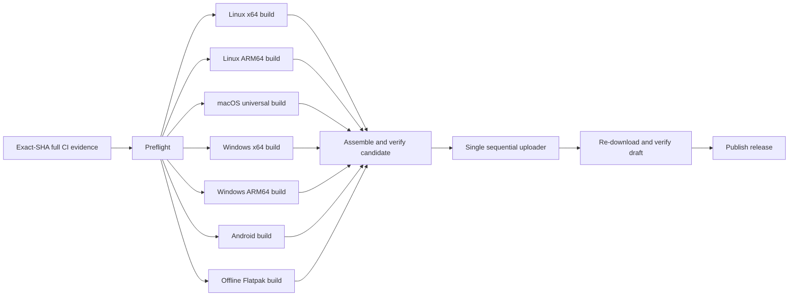

# Plan — parallel release builds, single publisher

**Status:** implemented on `master` in `dd6e0e0` (2026-07-11). Manual release
run [29165451611](https://github.com/martinkoutecky/tine/actions/runs/29165451611)
proved all five desktop builds + Android overlap, the real Flatpak build passes,
and candidate assembly produces the layout's exact 23-asset inventory / 12 updater entries without
touching GitHub Releases. The first real tagged publisher run is intentionally
the next explicitly authorized release; no dummy public version was cut.

## Outcome

All expensive work runs concurrently:

- Linux x64
- Linux ARM64
- macOS universal
- Windows x64
- Windows ARM64
- Android
- the real offline Flatpak validation build

No build job mutates a GitHub Release. Each job uploads a private workflow
artifact containing canonical release files plus a small machine-readable
fragment. After every required job succeeds, one short publisher downloads the
artifacts, assembles `latest.json` once, uploads files sequentially, verifies the
remote draft, and makes it public.

As of the release-only CI policy, this packaging workflow begins only after a
manually dispatched full `ci.yml` run succeeded on the exact frozen candidate
SHA. Release preflight queries Actions and verifies all four stable full-job
conclusions; PR, focused, skipped, stale-SHA, and failed runs are rejected before
toolchain setup or packaging. This preserves one full test/performance pass plus
one necessary platform packaging pass instead of rebuilding ordinary CI inside
the release workflow.

Expected effect: tagged release wall time becomes approximately the slowest
platform build plus a short publication step, rather than the sum of five
desktop build times.

## Why the old workflow serialized

`tauri-apps/tauri-action` built and published in one step. Each matrix
leg reads the draft's current `latest.json`, adds its platform, then deletes and
re-uploads the file. Parallel legs race: one can overwrite another platform or
collide on the same release asset. `max-parallel: 1` prevents corruption, but it
also serializes the expensive compilation.

The architectural boundary must move. Builds produce immutable inputs;
publication is the only release mutation and has one owner.

## Invariants to preserve

The v0.5.6 hardening remains mandatory, together with the exact-SHA CI gate:

1. A manually dispatched full CI run succeeded on the exact candidate SHA; all
   four stable full jobs are successful.
2. Metadata version, tag, changelog, Cargo locks, npm locks, and Android
   `versionCode` agree.
3. Vendored lsdoc WASM/oracle pins are current and the byte-pinned oracle keeps
   LF checkout semantics on every platform.
4. Both Flatpak offline dependency manifests are current, and the real Flatpak
   bundle build succeeds.
5. Tagged releases require a signed Android APK; missing secrets are fatal.
6. The final release contains exactly the layout's expected asset inventory.
7. `latest.json` contains exactly the expected 12 signed Linux/Windows updater
   platform entries.
8. Any failure leaves no public partial release.
9. A rerun is idempotent: it may reuse/replace a draft, but it must refuse to
   overwrite an already-public release.

## Target workflow



### 1. One shared release contract

Create `scripts/release-layout.mjs` as the single source of truth for:

- canonical filenames for each platform/architecture;
- which files require `.sig` companions;
- the 12 updater platform keys and the asset each points to;
- the expected final asset count.

Refactor `scripts/check-release-assets.mjs` to consume this contract. Build
staging and manifest generation must use it too; do not maintain three filename
lists that can drift.

### 2. Parallel build jobs stage workflow artifacts

Keep one five-entry desktop matrix, but use `max-parallel: 5` for both manual and
tag runs. The build step invokes the Tauri CLI without a release ID and without
GitHub-release upload behavior.

After compilation, a staging script copies/renames outputs into a stable layout:

```text
candidate/<lane>/
  release-fragment.json
  Tine_<version>_<platform file>
  Tine_<version>_<platform file>.sig   # where updater signing applies
```

Each `release-fragment.json` records:

- version, lane, target triple, and source commit;
- canonical asset filename, size, and SHA-256;
- updater platform key, URL filename, and signature text where applicable.

The staging step fails if an expected installer/signature is absent or if an
unexpected bundle is selected. Windows jobs create the portable zip in staging,
not on the release. Android uploads the signed canonical APK as another workflow
artifact. Flatpak remains a required validation job; adding its bundle to the
GitHub release is a separate product decision.

Use distinct artifact names (`release-linux-x64`, `release-windows-arm64`, etc.)
and short retention. Build jobs need only `contents: read`; only the eventual
publisher receives `contents: write`.

### 3. Candidate assembly is deterministic and release-free

An `assemble` job downloads all build artifacts and:

1. verifies every fragment has the requested version and exact tag commit;
2. rejects duplicate filenames/platform keys;
3. verifies recorded SHA-256 values and signatures;
4. verifies every platform asset in the layout (everything except `latest.json`);
5. creates `latest.json` once from the shared contract and fragments;
6. runs the same exact-inventory/12-platform verifier used after upload.

For `workflow_dispatch`, stop here and upload a `release-candidate` workflow
artifact. This exercises the complete build and assembly path without creating
or modifying a GitHub Release.

### 4. One idempotent publisher owns GitHub Release state

On a version tag only, the publisher:

1. looks up the release by tag;
2. creates a draft if none exists;
3. reuses it only if it is still a draft for the same commit;
4. removes/replaces stale draft assets from an earlier failed attempt;
5. uploads every platform asset in the layout sequentially;
6. uploads the fully assembled `latest.json` last;
7. re-downloads the draft assets and updater manifest and runs
   `check-release-assets.mjs` against the remote state;
8. changes `draft` to `false` only after verification passes.

If any step fails, the draft remains private. If a release for the tag is already
public, the publisher fails without mutation. Add workflow concurrency keyed by
the tag so two publishers cannot run for the same version.

## Migration sequence

1. Introduce the shared release contract, staging/assembly scripts, and fixture
   tests. Include negative fixtures for a missing Android APK, missing signature,
   duplicate updater key, wrong version/tag, and incomplete `latest.json`.
2. Change manual `release` dispatch to use parallel build artifacts and local
   assembly only. Keep tagged publication on the old safe serialized path during
   this phase.
3. Run the manual workflow on an exact release-shaped commit. Require all five
   desktop jobs to overlap in time, Android + Flatpak green, and the assembled
   candidate to pass the exact-inventory/12-platform contract.
4. Switch tagged publication to the single publisher. Preserve the serialized
   workflow revision as the documented rollback commit; do not cut a dummy public
   version just to test publishing.
5. At the next explicitly authorized release, supervise the first real tag. If
   assembly/upload verification fails, keep the draft, fix forward, and rerun;
   never bypass the verifier manually.

## Acceptance criteria

- All five desktop build jobs begin concurrently on tagged and manual runs.
- No build job calls `gh release`, supplies a `releaseId`, or writes
  `latest.json` to GitHub.
- Manual dispatch produces a verified release-candidate artifact without
  touching GitHub Releases.
- The publisher is the sole job with release-write permissions.
- Forced loss of any required artifact/signature/platform fails before publish.
- A failed publisher rerun is safe and idempotent.
- The real offline Flatpak job and signed Android job are hard dependencies.
- Remote verification reports the layout's exact inventory and 12 updater entries.
- The public release is created only after all expensive builds have completed;
  the post-build publication phase is short and sequential.

## Non-goals

- Changing installer formats or updater trust roots.
- Adding macOS to the Tauri updater before a signed macOS updater artifact exists.
- Publishing the Flatpak bundle as a GitHub release asset without a separate
  product decision.
- Weakening the current fail-closed release gates to gain speed.
